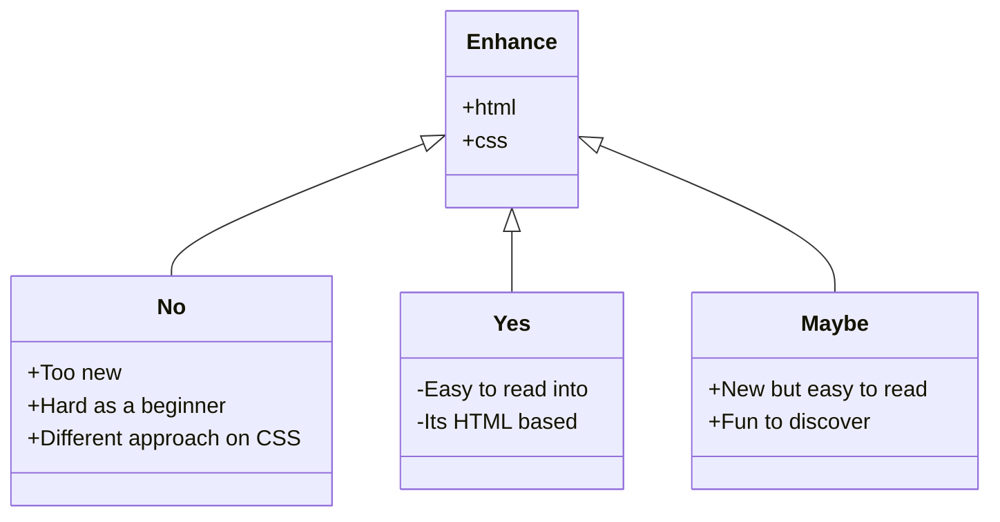

## Hygraph data into Enhance

Eventhough it was a hard task, I did manage to load in the Hygraph API into the Enhance framework with the help of their documentation and my brother (who builds APIs himself and can read it better than I do)

I loaded in data through 
```js
export async function get() {
  const apiUrl =
    "https://eu-central-1.cdn.hygraph.com/content/cl54wpnkq38x701t370gr4cvs/master";
```
and made sure it was called back by a manual GraphQL query string, which inspiration came from the FDND repository in Sveltekit. This way of coding had been done this way, so I took over that part of the code. 
```js
const query = `
  query Program {
    program(where: {id: "cl9pm4is9l9xu0atdbqxnd710"}) {
      title
      subtitle
      content {
        html
      }
      semesters {
        title
        slug
        sprints (first: 20) {
          title
          slug
          sprintNumber
          startdate
        }
      }
    }
  }
`;
```
I then created a index.mjs file in a 'page' folder and called back the data from the api folder, by doing this:
```js
```js
    <h1>${program.title}</h1>
    <h2>${program.subtitle}</h2>
```

## Issues occorred

**20-10-2024**
There has been some issues with pushing and pulling through laptop and desktop. I didn't push my progress on my laptop but did push on my laptop which created collission in files. I had to look through my commits and returned everything manually.

## Assignment Argumentation 

**Why am I using this framework?**
I'm using the Enhance framework because it's an HTML-based framework that creates a more semantic site and uses HTML as its foundation. This makes it accessible and easy to build on compared to other JavaScript frameworks.

**Why does it suit this specific project?**
Since we're building the new website for the FDND site, I think it's crucial to start with HTML and CSS as a base. This provides a great example for new students, allowing them to inspect the code and figure out how it's built without diving into layers of divs created by JS frameworks. It's essentially the business card of the study, starting with the fundamentals of frontend coding.

**Will I use this framework in the future?**
For now, I'd say no because it's brand new and lacks documentation. As a beginner, it's challenging to figure things out on my own. There aren't many articles, YouTube videos, or comprehensive documentation to guide me. However, I believe that once this framework becomes more popular, it will be easy to use and start with. I'm not a fan of their CSS approach, though, especially as a beginner.

**Argumentation Diagram**



## Sources

[begin-Css-Approach](https://begin.com/blog/posts/2023-01-10-past-informs-the-present-our-approach-to-css)
[Podcast-Twitch-Enhance](https://www.youtube.com/watch?v=e3U2Hwgt1Ds&t=2569s)